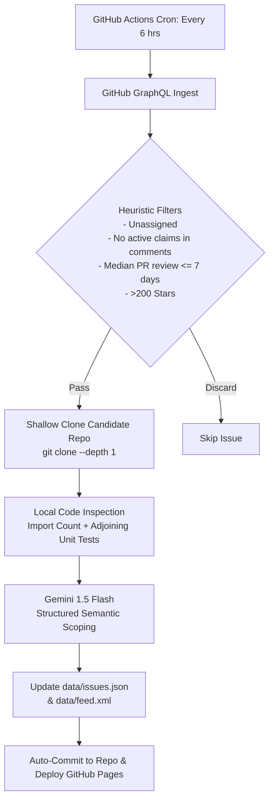

# 🛰️ OSS Issues Radar

[](https://github.com/jakeweidokal/oss-issues/actions/workflows/scan.yml)
[](https://jakeweidokal.github.io/oss-issues/)
[](https://jakeweidokal.github.io/oss-issues/data/feed.xml)
[](LICENSE)

An automated, zero-cost pipeline that continuously scans GitHub for verified, solvable open-source issues with active maintainers, scores them for blast radius and setup friction, and serves them via an interactive static web dashboard and RSS feed.

---

## ⚡ Key Highlights

- **$0 Operating Cost**: Runs on GitHub Actions public runners, GitHub GraphQL API free quotas, ephemeral ripgrep / AST checks, and Gemini 1.5 Flash free tier.
- **Maintainer Responsiveness Guard**: Filters out ghost issues by evaluating repository push recency (≤ 14 days) and median PR review turnaround time (≤ 7 days).
- **Claim & Collision Detection**: Regex-scans recent issue comments to eliminate tickets already being worked on by other contributors.
- **Local AST & Code Isolation Inspection**: Shallow clones candidate repositories (`--depth=1`) in CI to verify module isolation, import counts, and adjoining unit tests (`*.test.ts`, `*.spec.js`, `test_*.py`).
- **Targeted Semantic Scoping**: Uses Gemini 1.5 Flash in structured JSON schema mode to extract blast radius, setup friction, solvability ratings (1–10), and quick reproduction test commands.
- **Static Web UI & Syndication**: Zero-dependency static directory with instant client-side search, multi-faceted filtering, one-click copy commands, and an Atom/RSS 2.0 feed.

---

## 🏗️ Architecture



---

## 🚀 Local Development & Testing

### 1. Prerequisites
- Node.js 22+
- `pnpm` (or `npm`)
- GitHub CLI (`gh`) logged in, or `GITHUB_TOKEN` environment variable
- (Optional) `GEMINI_API_KEY` from [Google AI Studio](https://aistudio.google.com/) (dry-run mode works without an API key)

### 2. Installation
```bash
git clone https://github.com/jakeweidokal/oss-issues.git
cd oss-issues
pnpm install
```

### 3. Run Scanner Locally
```bash
# Dry-run mode (uses local heuristics fallback, tests GraphQL and inspection)
pnpm scan:dry --limit=5

# Live production run
pnpm scan --limit=10
```

### 4. Preview Frontend
Open `src/site/index.html` in any browser or run a lightweight local static server:
```bash
npx serve src/site
```

---

## 🔒 Configuration & GitHub Secrets

To enable live Gemini AI semantic analysis on GitHub Actions:
1. Obtain a free API key from [Google AI Studio](https://aistudio.google.com/).
2. Add it to your repository secrets:
   - Name: `GEMINI_API_KEY`
   - Value: `<your-gemini-api-key>`
   - Or via CLI: `gh secret set GEMINI_API_KEY`

---

## 📄 License

MIT © Jake Weidokal
